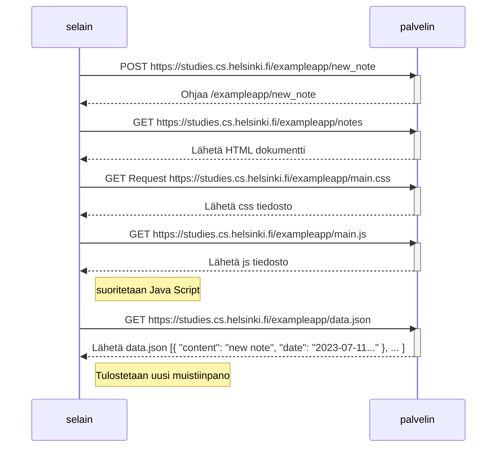

## Tehtävä 0.4

```mermaid
sequenceDiagram
    participant selain
    participant palvelin
    
    selain->>palvelin: POST https://studies.cs.helsinki.fi/exampleapp/new_note
    activate palvelin
    palvelin-->>selain: Ohjaa /exampleapp/new_note
    deactivate palvelin
    
    selain->>palvelin: GET https://studies.cs.helsinki.fi/exampleapp/notes
    activate palvelin
    palvelin-->>selain: Lähetä HTML dokumentti
    deactivate palvelin
    
    selain->>palvelin: GET Request https://studies.cs.helsinki.fi/exampleapp/main.css
    activate palvelin
    palvelin-->>selain: Lähetä css tiedosto
    deactivate palvelin
    
    selain->>palvelin: GET https://studies.cs.helsinki.fi/exampleapp/main.js
    activate palvelin
    palvelin-->>selain: Lähetä js tiedosto
    deactivate palvelin
    
    Note right of selain: suoritetaan Java Script
    
    selain->>palvelin: GET https://studies.cs.helsinki.fi/exampleapp/data.json
    activate palvelin
    palvelin-->>selain: Lähetä data.json [{ "content": "new note", "date": "2023-07-11..." }, ... ]
    deactivate palvelin    

    Note right of selain: Tulostetaan uusi muistiinpano
```