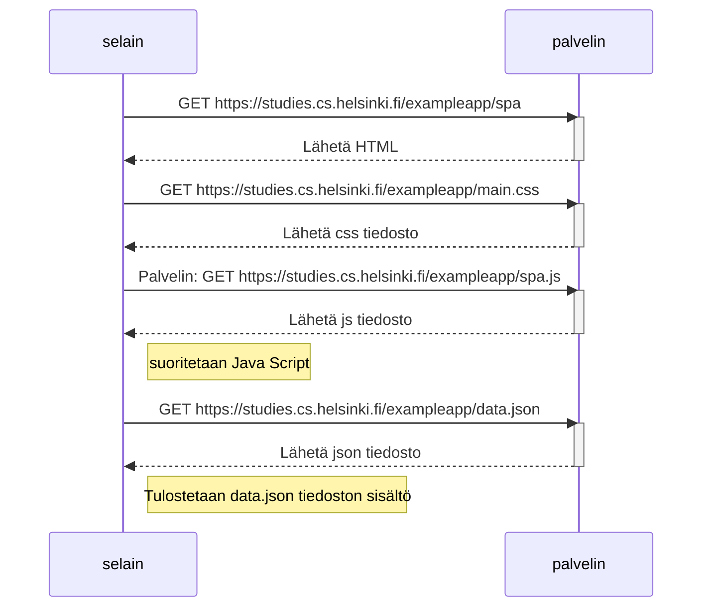

## Tehtävä 0.5

```mermaid
sequenceDiagram
    participant selain
    participant palvelin
    
    selain->>palvelin: GET https://studies.cs.helsinki.fi/exampleapp/spa
    activate palvelin
    palvelin-->>selain: Lähetä HTML
    deactivate palvelin
    
    selain->>palvelin: GET https://studies.cs.helsinki.fi/exampleapp/main.css
    activate palvelin
    palvelin-->>selain: Lähetä css tiedosto
    deactivate palvelin
    
    selain->>palvelin: Palvelin: GET https://studies.cs.helsinki.fi/exampleapp/spa.js
    activate palvelin
    palvelin-->>selain: Lähetä js tiedosto
    deactivate palvelin
    
    Note right of selain: suoritetaan Java Script
    
    selain->>palvelin: GET https://studies.cs.helsinki.fi/exampleapp/data.json
    activate palvelin
    palvelin-->>selain: Lähetä json tiedosto
    deactivate palvelin    

    Note right of selain: Tulostetaan data.json tiedoston sisältö
```